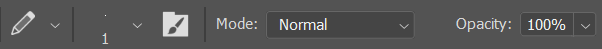
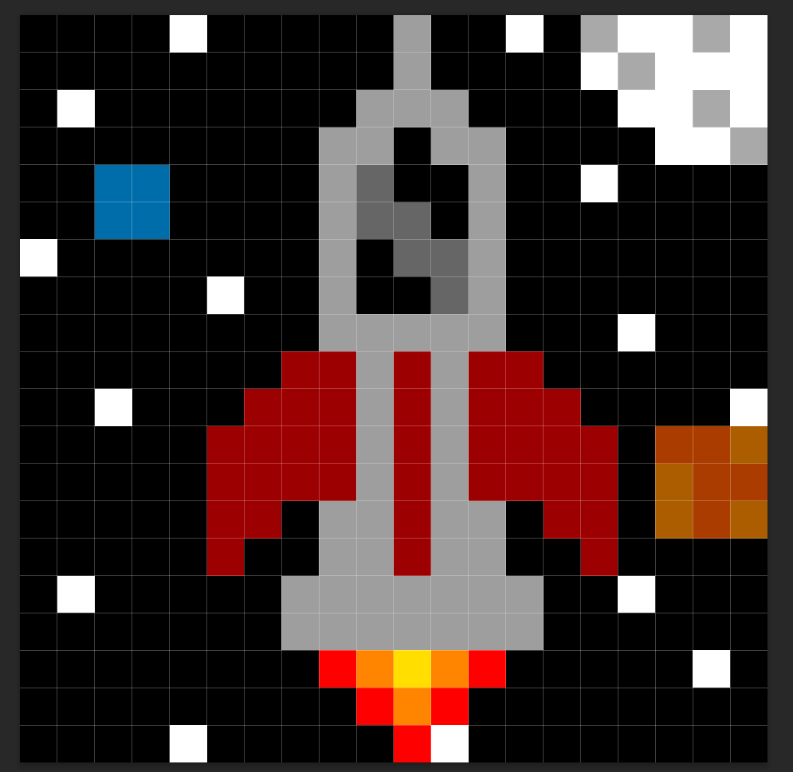
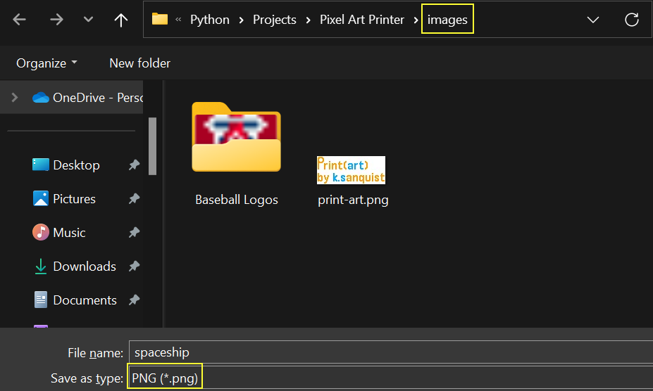

# What is Print(art)?
### Print(art) is a Python application that allows you to print your pixel art masterpieces to the terminal in full color! 

# How do I use it?
### Printing your masterwork with Print(art) is a super easy process! All you need to do is create your masterpiece in a painting software, save it as a PNG, and follow the steps below to navigate the UI, and you'll have your artpieces printed in no time!

## Step 1: Choosing Your Paint Software
### Your quest for creating pixel art that Vincent Van Gogh would drool over starts in your painting software of choice! For this walkthrough, I'll be using Adobe Photoshop, but there are plenty of other painting applications that will work just fine (I recommend Procreate if you have an IPad!).

## Step 2: Setting up Your Canvas
### To start, we need an appropriately sized canvas. For this example, I'll use a 20x20 pixel canvas:


## Step 3: Setting up Your Drawing Tool
### We now have our canvas, and can start drawing, here's the pencil settings I use for my pixel art:


## Step 4: Creating Your pièce de résistance
### Now that we have our canvas and pencil set up we can create our magnum opus, here's what I came up with:


## Step 5: Saving your Artwork
### Finally, all that's left to do is save our masterwork as a PNG (*if you don't save it as a PNG, your artpiece will not be printed!*). While you can save your artwork to any destination, we have provided you with an *images* folder as a convenient storage option!


## Step 6: Using Print(art) to Print Your Masterpiece to the Terminal!
### After all the work you've done, you deserve to see your masterpiece in all of its pixelated glory printed onto your terminal!
### When you start up the Print(art) application you'll be greated with the following UI:
```
What would you like to do?
( 0 )  Exit Program
( 1 )  Print a single image of your choice
( 2 )  Print all images in a given directory

[Enter Number] : 
```
### Here you can either (1) print a single PNG image of your choosing or (2) print an entire folder's worth of images. We'll first show you how to print a single image and then show you how to print a ton of images! To print a single image input `2` where it says `[Enter Number] : `
```
...
[Enter Number] : 2
```
### Once you click enter to submit your input, a file selector will appear. By default, the selector will open up in 'images' folder (*because that's where you should have saved your image*) and you will only be able to select PNG files.

  
Once you've selected your image it will begin to generate the printable String and once it's done, it will print your pixel art creation to the terminal!
  

You can now press ENTER and you will be returned to the main menu where you can print additional images, start another masterpiece by creating a new template, or exit the program if you've had your share of fun! And that's it, you've successfully printed your first pixel artwork!  
  
## Printing Multiple Pixel Art Pieces at a Time
### Say you have a whole directory — possibly a portfolio — composed of many pixel art masterpieces, and you have a dying need to print all these pieces to the terminal in one fell swoop! Lucky for you, there is a feature in Print(art) that can help you do that exact thing  

If you're keen in observation, you might have noticed an option that could lead us down the right path to printing your pixelated portfolio:
```
What would you like to do?
( 0 )  Exit program
( 1 )  Create a new template
( 2 )  Print a single image of your choice
( 3 )  Print all images in a given directory

[Enter Number] : 3
```
* Option 3, "Print all images in a given directory" is what we're looking for here

After you input that option the process for printing is almost identical to what we went through when printing a single image magnum opus:  

