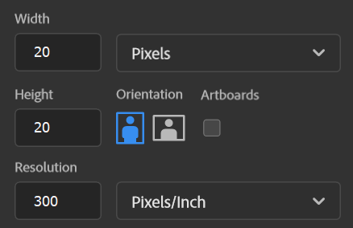

# What is Print(art)?
### Print(art) is a Python application that allows you to print your pixel art masterpieces to the terminal in full color! 

# How do I use it?
### Printing your masterwork with Print(art) is a super easy process! All you need to do is create your masterpiece in a painting software, save it as a PNG, and follow the steps below to navigate the UI, and you'll have your artpieces printed in no time!

## Step 1: Creating Your Pixel Art Masterpiece!
### Your quest for creating pixel art that Vincent Van Gogh would drool over starts in your painting software of choice! For this walkthrough, I'll be using Adobe Photoshop, but there are plenty of free painting applications that will work perfectly.

### To start, we need an appropriately sized canvas. For this example, I'll use a 20x20 pixel canvas:



## Step 2: Creating Your Pixel Art Masterpiece Using your Template
### Now that you have your pristine, one-of-a-kind, custom template, you can start creating your pixel art magnum opus with it! As of version 1.0, there is no paint tool built into the application so a 3rd-party painting software is required. Any painting software works, however, this example will focus on using Microsoft Paint.  

This step is fairly simple all you have to do is open your created template, saved in the *templates* folder, in your chosen paint software:  
  
  

I'm afraid to say, but I can't help you with the next part, because it's all up to you to create your beautiful pixel art kin. Here's what I made:


While my creation isn't all that original, it'll do the job. Now that we have our pixel art masterpiece finished we need to SAVE AS to the *images* folder located in the same folder as main.py.  
***!!! WARNING !!!*** Make sure you save your creationg as a ***PNG*** or it will not be print!  


## Step 3: Printing Your Perfect Pixel Portrait
### You've done all this preperation and creation to get to this very point, the printing of your amazing artwork. So what do you do now?  

Let's go back to the main menu of the application and input '2' as our command:
```
What would you like to do?
( 0 )  Exit program
( 1 )  Create a new template
( 2 )  Print a single image of your choice
( 3 )  Print all images in a given directory

[Enter Number] : 2
```

Once you click enter to submit your input, a file selector will appear. By default, the selector will open up in 'images' folder (*because that's where you should have saved your image*) and you will only be able to select PNG files.

  
Once you've selected your image it will begin to generate the printable String and once it's done, it will print your pixel art creation to the terminal!
  

You can now press ENTER and you will be returned to the main menu where you can print additional images, start another masterpiece by creating a new template, or exit the program if you've had your share of fun! And that's it, you've successfully printed your first pixel artwork!  
  
## Printing Multiple Pixel Art Pieces at a Time
### Say you have a whole directory — possibly a portfolio — composed of many pixel art masterpieces, and you have a dying need to print all these pieces to the terminal in one fell swoop! Lucky for you, there is a feature in Print(art) that can help you do that exact thing  

If you're keen in observation, you might have noticed an option that could lead us down the right path to printing your pixelated portfolio:
```
What would you like to do?
( 0 )  Exit program
( 1 )  Create a new template
( 2 )  Print a single image of your choice
( 3 )  Print all images in a given directory

[Enter Number] : 3
```
* Option 3, "Print all images in a given directory" is what we're looking for here

After you input that option the process for printing is almost identical to what we went through when printing a single image magnum opus:  

