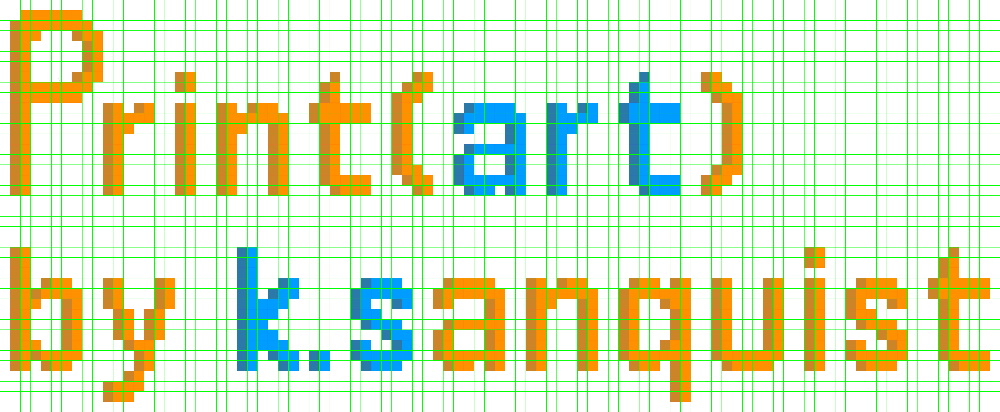
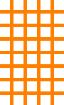
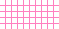

# What is Print(art)?
### Print(art) is a Python application that allows you to print your pixel art masterpieces to the terminal in full color!  

# How do I use it?
### Printing your masterwork with Print(art) is a relatively easy process. All you need to do is create your showpiece using a Print(art)-friendly template that — lucky for you — can be created with the template generator that built-in to the application. the following is a more indepth, step-by-step walkthrough on how to create your first pièce de résistance with Print(art):  

## Step 1: Creating Your Custom Pixel Art Template
### Your quest for creating pixel art that Vincent Van Gogh would drool over starts here! Creating a template for your pixel art is a necessary step in the art printing process as it creates a uniform template for what the color printer is to expect when scanning the fabulous hues of your masterstroke.  
  
When you start the application, you will be introduced to the main menu:
```
What would you like to do?
( 0 )  Exit program
( 1 )  Create a new template
( 2 )  Print a single image of your choice
( 3 )  Print all images in a given directory

[Enter Number] : 
```  

All you have to do is input '1' and you will be taken to the template generator where you'll be met with multiple prompts related to the customization of your grid. These prompts are:

1. How wide, in grid squares, do you want the template?
    * This is asking you how many blocks *wide* you want your template to be
        * e.g. if you want a 5 x 9 grid template, you would input '5' here!
          
2. How tall, in grid squares, do you want the template?
    * This is asking you how many blocks *tall* you want your template to be
        * e.g. if you want a 5 x 9 grid template, you would input '9' here!
          
3. What color do you want the grid lines to be?
    * This question will be accompanied by a color-picker in which you will choose the line color for your template
    * ***!!! WARNING !!!*** Make sure you choose a template line color that does not match any of the colors you will use in your masterpiece

You will then be asked about the *advanced* settings of the template generator. These templates will not change how your chef d'œuvre so customizing these values is not necessary to the process. These settings are the line thickness of the template (*set to 3px by default*) and the height and width of each grid square (*set to 60px by default*). You are allowed to change these setting's by inputting 'N' when asked if the default advanced parameters are okay, and the input process is the same as the non-advance template settings.    
You will then be given a brief rundown of the settings you inputted into for your template, an example of this might look like:
```
GRID SQUARE HEIGHT & WIDTH : 60
            WIDTH x HEIGHT : 5 x 9
                LINE COLOR : #ff80c0 ██
                LINE WIDTH : 3
```
* Note: the square next to the hex code ( ██ ) will be the color you selected
  
Once you confirm your parameters, the template is created and sent to the *templates* folder, located in the same folder as main.py under the name:  
  
*[block height and width]px_[template width]x[template height]_[line widgth]lw.png*   
  
So if you've created a template with the following parameters:  
```
GRID SQUARE HEIGHT & WIDTH : 60
            WIDTH x HEIGHT : 5 x 9
                LINE COLOR : #ff80c0 ██
                LINE WIDTH : 3
```
The template would be saved under the file name: *60px_5x9_3lw.png*

Here are some examples of templates that are created for you by default:  






## Step 2: Creating Your Pixel Art Masterpiece Using your Template


