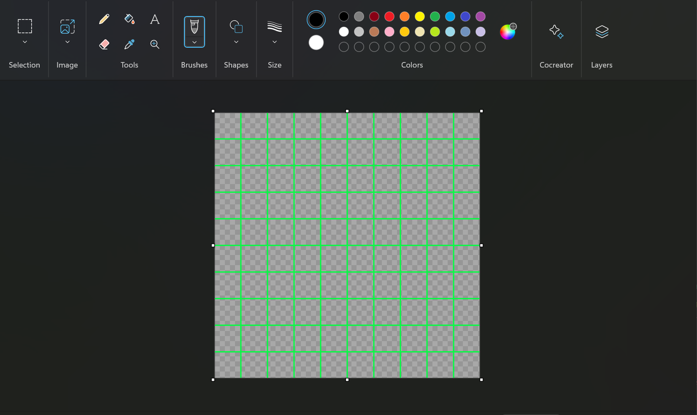
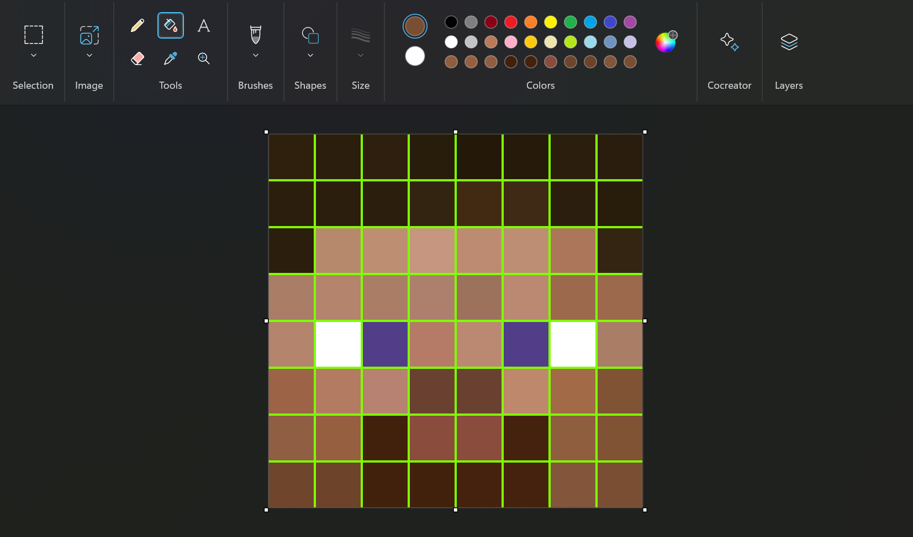
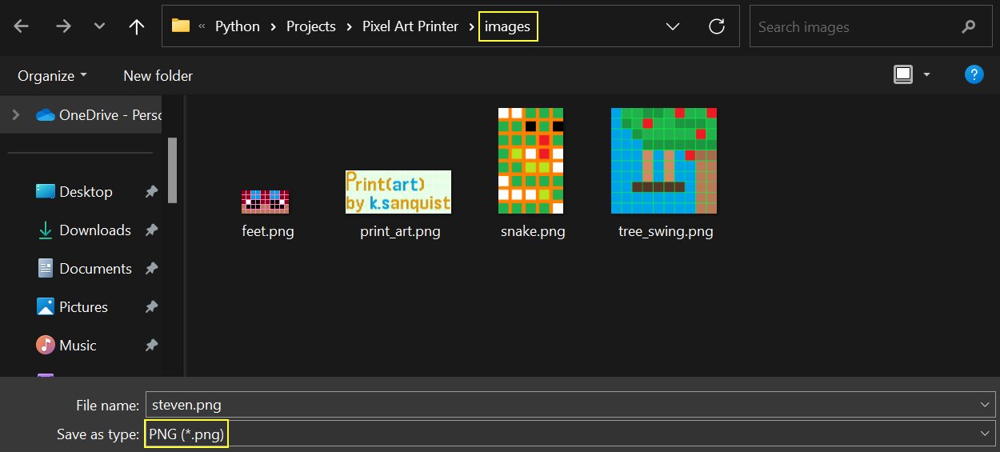
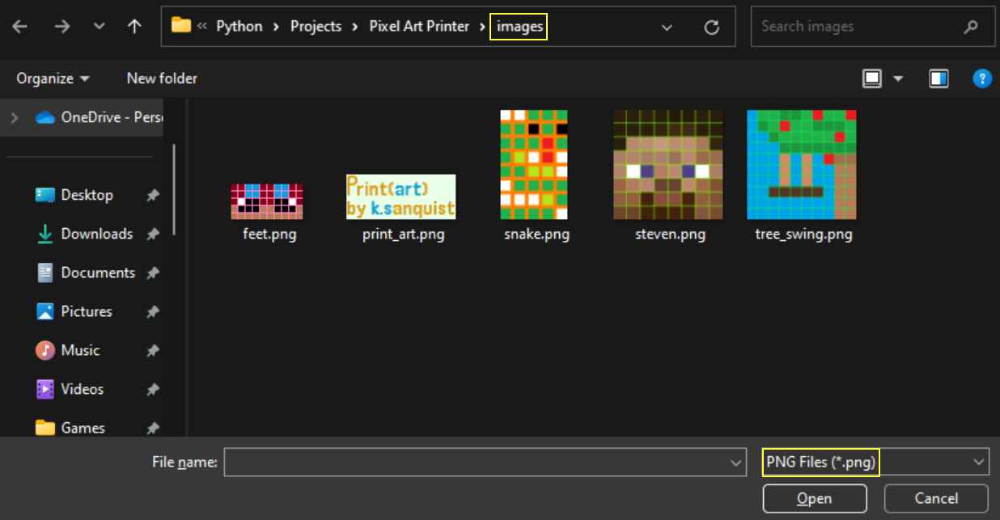
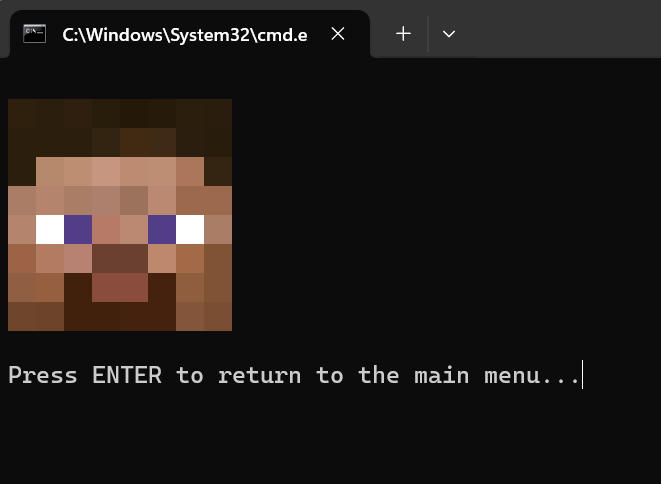
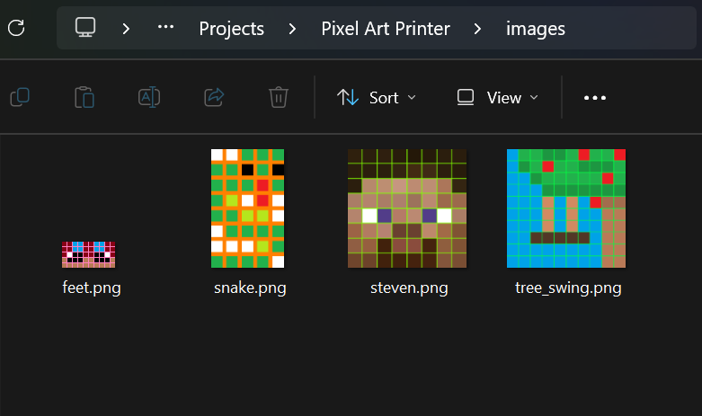

# What is Print(art)?
### Print(art) is a Python application that allows you to print your pixel art masterpieces to the terminal in full color!  

# How do I use it?
### Printing your masterwork with Print(art) is a relatively easy process. All you need to do is create your showpiece using a Print(art)-friendly template that — lucky for you — can be created with the template generator that built-in to the application. the following is a more indepth, step-by-step walkthrough on how to create your first pièce de résistance with Print(art):  

## Step 1: Creating Your Custom Pixel Art Template
### Your quest for creating pixel art that Vincent Van Gogh would drool over starts here! Creating a template for your pixel art is a necessary step in the art printing process as it creates a uniform template for what the color printer is to expect when scanning the fabulous hues of your masterstroke.  
  
When you start the application, you will be introduced to the main menu:
```
What would you like to do?
( 0 )  Exit program
( 1 )  Create a new template
( 2 )  Print a single image of your choice
( 3 )  Print all images in a given directory

[Enter Number] : 
```  

All you have to do is input '1' and you will be taken to the template generator where you'll be met with multiple prompts related to the customization of your grid. These prompts are:

1. How wide, in grid squares, do you want the template?
    * This is asking you how many blocks *wide* you want your template to be
        * e.g. if you want a 5 x 9 grid template, you would input '5' here!
          
2. How tall, in grid squares, do you want the template?
    * This is asking you how many blocks *tall* you want your template to be
        * e.g. if you want a 5 x 9 grid template, you would input '9' here!
          
3. What color do you want the grid lines to be?
    * This question will be accompanied by a color-picker in which you will choose the line color for your template
    * ***!!! WARNING !!!*** Make sure you choose a template line color that does not match any of the colors you will use in your masterpiece

You will then be asked about the *advanced* settings of the template generator. These templates will not change how your chef d'œuvre so customizing these values is not necessary to the process. These settings are the line thickness of the template (*set to 3px by default*) and the height and width of each grid square (*set to 60px by default*). You are allowed to change these setting's by inputting 'N' when asked if the default advanced parameters are okay, and the input process is the same as the non-advance template settings.    
You will then be given a brief rundown of the settings you inputted into for your template, an example of this might look like:
```
GRID SQUARE HEIGHT & WIDTH : 60
            WIDTH x HEIGHT : 5 x 9
                LINE COLOR : #ff80c0 ██
                LINE WIDTH : 3
```
* Note: the square next to the hex code ( ██ ) will be the color you selected
  
Once you confirm your parameters, the template is created and sent to the *templates* folder, located in the same folder as main.py under the name:  
  
*[block height and width]px_[template width]x[template height]_[line widgth]lw.png*   
  
So if you've created a template with the following parameters:  
```
GRID SQUARE HEIGHT & WIDTH : 60
            WIDTH x HEIGHT : 5 x 9
                LINE COLOR : #ff80c0 ██
                LINE WIDTH : 3
```
The template would be saved under the file name: *60px_5x9_3lw.png*

Here are some examples of templates that are created for you by default:  


## Step 2: Creating Your Pixel Art Masterpiece Using your Template
### Now that you have your pristine, one-of-a-kind, custom template, you can start creating your pixel art magnum opus with it! As of version 1.0, there is no paint tool built into the application so a 3rd-party painting software is required. Any painting software works, however, this example will focus on using Microsoft Paint.  

This step is fairly simple all you have to do is open your created template, saved in the *templates* folder, in your chosen paint software:  
  
  

I'm afraid to say, but I can't help you with the next part, because it's all up to you to create your beautiful pixel art kin. Here's what I made:



While my creation isn't all that original, it'll do the job. Now that we have our pixel art masterpiece finished we need to SAVE AS to the *images* folder located in the same folder as main.py.  
***!!! WARNING !!!*** Make sure you save your creationg as a ***PNG*** or it will not be print!  



## Step 3: Printing Your Perfect Pixel Portrait
### You've done all this preperation and creation to get to this very point, the printing of your amazing artwork. So what do you do now?  

Let's go back to the main menu of the application and input '2' as our command:
```
What would you like to do?
( 0 )  Exit program
( 1 )  Create a new template
( 2 )  Print a single image of your choice
( 3 )  Print all images in a given directory

[Enter Number] : 2
```

Once you click enter to submit your input, a file selector will appear. By default, the selector will open up in 'images' folder (*because that's where you should have saved your image*) and you will only be able to select PNG files.

  
Once you've selected your image it will begin to generate the printable String and once it's done, it will print your pixel art creation to the terminal!
  

You can now press ENTER and you will be returned to the main menu where you can print additional images, start another masterpiece by creating a new template, or exit the program if you've had your share of fun! And that's it, you've successfully printed your first pixel artwork!  
  
## Printing Multiple Pixel Art Pieces at a Time
### Say you have a whole directory — possibly a portfolio — composed of many pixel art masterpieces, and you have a dying need to print all these pieces to the terminal in one fell swoop! Lucky for you, there is a feature in Print(art) that can help you do that exact thing  

If you're keen in observation, you might have noticed an option that could lead us down the right path to printing your pixelated portfolio:
```
What would you like to do?
( 0 )  Exit program
( 1 )  Create a new template
( 2 )  Print a single image of your choice
( 3 )  Print all images in a given directory

[Enter Number] : 3
```
* Option 3, "Print all images in a given directory" is what we're looking for here

After you input that option the process for printing is almost identical to what we went through when printing a single image magnum opus. The only difference is you'll be asked to select a folder, in which your pixel art pieces reside, instead of a PNG file.  
***!!! WARNING !!!*** Keep in mind that all non-PNG files in the directory of your choosing will be skipped during printing!  

For this example we'll print all the images in the 'image' directory (*it isn't required that you put your pixel artworks in the 'images' folder, it is simply provided for your convinence*):
  

Once you've selected your folder, all you need to do is wait a varrying amount of time based on the size of your creations, and you'll have your portfolio in front of you printing in prestine color in the terminal!  
